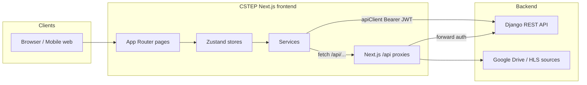
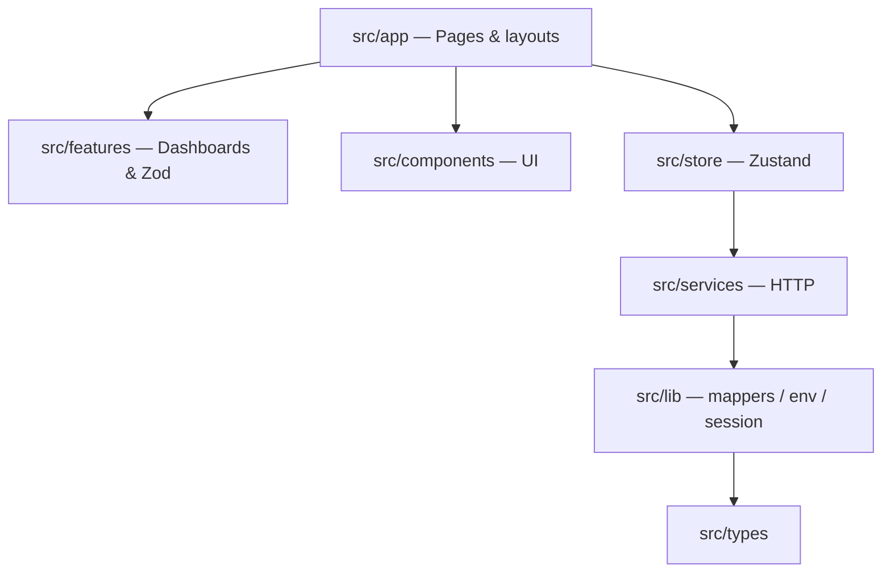
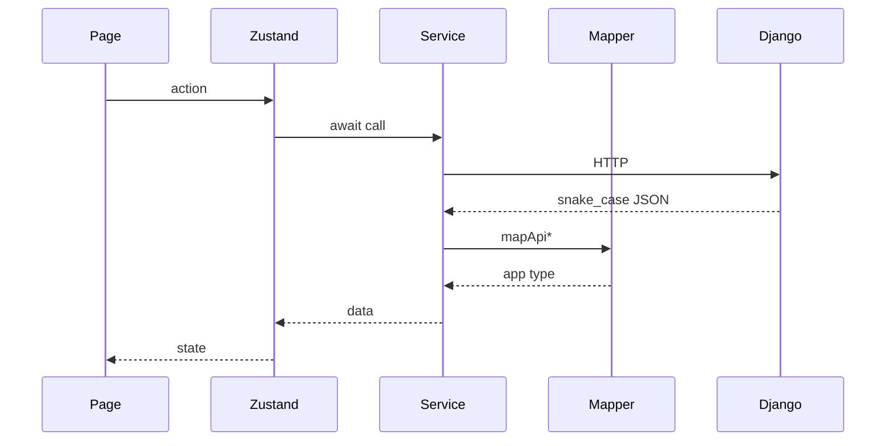

# CSTEP — Event Management Platform

CSTEP is a **Next.js** web application for conference and event operations: delegate registration, lobby management, travel/medical/translation/accommodation assistance, live streaming, analytics, and admin dashboards. The frontend talks to a **Django REST API** backend.

---

## Table of contents

- [Overview](#overview)
- [Tech stack](#tech-stack)
- [Getting started](#getting-started)
- [Environment variables](#environment-variables)
- [Project structure](#project-structure)
- [Architecture](#architecture)
- [User roles & routes](#user-roles--routes)
- [API integration](#api-integration)
  - [How requests are made](#how-requests-are-made)
  - [Django backend endpoints](#django-backend-endpoints)
  - [Next.js API routes (proxies)](#nextjs-api-routes-proxies)
  - [Status value mapping](#status-value-mapping)
- [Key workflows](#key-workflows)
- [Scripts](#scripts)
- [Deployment](#deployment)

---

## Overview

| Area | Description |
|------|-------------|
| **Public site** | Landing page, event info, sign up / login, event registration |
| **Live streaming** | `/streaming` — HLS from event broadcast sessions; multi-camera switcher when several sessions exist; scrolling headphones reminder; optional env fallback for dev |
| **Profile** | Delegates request travel, medical, translation, and accommodation support |
| **Dashboard** | Role-based admin tools for lobby, assistance requests (accept / hold / reject), events, users, analytics; notification bell for moderators / event admins |
| **Notifications** | Bell on dashboard (staff) and home navbar (users). REST `/notification/notification/…` + live WS `/ws/notifications/?token=` |
| **Video management** | Broadcast session setup and stream URL management (event administrators) |

The app uses **Zustand** for client state, **React Hook Form + Zod** for forms, **TanStack Table** for data grids, and **Axios** (`apiClient`) for authenticated backend calls.

---

## Tech stack

- **Framework:** Next.js 16 (App Router), React 19, TypeScript
- **Styling:** Tailwind CSS 4, Radix UI primitives
- **State:** Zustand
- **Forms / validation:** react-hook-form, Zod
- **HTTP:** Axios with JWT interceptors and token refresh
- **Streaming:** hls.js; live playback from broadcast session HLS URLs (Google Drive proxy legacy-only)
- **Charts:** Recharts; India state choropleth + country globe via `d3-geo` + `public/maps/india-states.geojson` / `world-countries.geojson`
- **Export:** jsPDF, xlsx

---

## Getting started

### Prerequisites

- Node.js 20+
- npm
- Running Django API (see `NEXT_PUBLIC_API_URL`)

### Install & run

```bash
npm install
cp .env.example .env.local   # then edit values
npm run dev
```

Open [http://localhost:3000](http://localhost:3000).

### Production build

```bash
npm run build
npm start
```

### Clear Next.js cache (if routes break in dev)

```bash
npm run clean
npm run dev
```

---

## Environment variables

Create `.env.local` from `.env.example`:

| Variable | Required | Description |
|----------|----------|-------------|
| `NEXT_PUBLIC_API_URL` | Yes | Django API base URL — use `http://` or `https://` exactly as your server supports (not auto-upgraded) |
| `NEXT_PUBLIC_WS_URL` | Recommended | WebSocket origin (`ws://` or `wss://`) for live analytics, event presence, event chat, and notifications (`…/ws/notifications/?token=`). If unset, derived from `NEXT_PUBLIC_API_URL` protocol |
| `NEXT_PUBLIC_APP_URL` | Recommended | Public frontend URL for share links and redirects |
| `NEXT_PUBLIC_LIVE_STREAM_URL` | Optional | Dev fallback when no active broadcast session (`.m3u8` HLS or direct video) |
| `NEXT_PUBLIC_LIVE_STREAM_FILE_ID` | Optional | Legacy Google Drive proxy (`/api/stream/video`) only — not used for public Watch Live |
| `NEXT_PUBLIC_STREAM_LEFT_BANNER_URL` | Optional | Left banner image on streaming page |
| `NEXT_PUBLIC_STREAM_RIGHT_BANNER_URL` | Optional | Right side fallback image when Camera 3 is unavailable |
| `NEXT_PUBLIC_STREAM_OPEN_TO_BASE_USERS` | Optional | Base-user Watch Live: unset = opens **19 Aug 2026 06:00 IST**; `true` = force open; `false` = keep locked |
| `NEXT_PUBLIC_EVENT_ENDED` | Optional | Public event window: unset = ends **21 Aug 2026 16:00 IST**; `true` = force ended (no event registration, home shows recordings); `false` = keep open |
| `NEXT_PUBLIC_BRAND_LOGO_DARK_SRC` | Optional | Dark theme logo path |

After changing any `NEXT_PUBLIC_*` variable in `.env.local`, **restart the dev server** (`npm run clean && npm run dev` if the old protocol still appears). In production, **redeploy** so the build picks up new values.

---

## Project structure

```
c-step/
├── docs/                      # Source PDFs (Concept Note, Agenda); copies served from public/docs/
├── public/                    # Static assets (logos, banner images, conference PDFs)
│   └── maps/                  # India states GeoJSON + world countries (India outline dissolved from states)
├── src/
│   ├── app/                   # Next.js App Router pages & API routes
│   │   ├── (auth)/            # login, signup, otp, forgot-password, reset-password
│   │   ├── api/               # Server-side proxy routes
│   │   │   ├── broadcast-sessions/
│   │   │   └── stream/        # Google Drive video proxy
│   │   ├── dashboard/         # Admin dashboard pages
│   │   │   ├── analytics/     # Overview + attendance-mode analytics
│   │   │   ├── accommodation/
│   │   │   ├── events/
│   │   │   ├── feedback/
│   │   │   ├── lobby/
│   │   │   ├── medical/
│   │   │   ├── translation/
│   │   │   ├── travel/
│   │   │   ├── users/
│   │   │   ├── video-management/
│   │   │   └── ...
│   │   ├── event-register/    # Event registration flow
│   │   ├── profile/           # Delegate profile & support requests
│   │   ├── register/          # Legacy/alternate registration
│   │   ├── streaming/         # Live stream viewer
│   │   ├── layout.tsx         # Root layout
│   │   └── page.tsx           # Landing / home
│   ├── components/
│   │   ├── auth/              # Auth guards, PhoneWithCountryCode, SignupLocationFields
│   │   ├── dashboard/         # Admin dialogs, event cards, lobby & analytics UI
│   │   │   ├── AttendanceModeAnalytics.tsx
│   │   │   ├── EventFeedbackCharts.tsx
│   │   │   ├── LiveLoginInsightsCharts.tsx
│   │   │   ├── SessionParticipationAnalytics.tsx
│   │   │   ├── CountryRegistrationsGlobe.tsx
│   │   │   ├── IndiaStateRegistrationsMap.tsx
│   │   │   ├── EventSelectCard.tsx
│   │   │   └── *AssistanceDialog.tsx
│   │   ├── forms/             # Multi-step form shell
│   │   ├── layout/            # Navbar, sidebar, dashboard shell
│   │   ├── profile/           # Profile support forms
│   │   ├── providers/         # Auth, theme providers
│   │   ├── shared/            # DataTable, ExportMenu, NotificationDropdown, guards, etc.
│   │   ├── streaming/         # VideoPlayer, StreamCameraPicker, LiveChatPanel, StreamingHeadphonesNotice, StreamAccessGuard
│   │   └── ui/                # shadcn-style UI primitives
│   ├── features/
│   │   ├── dashboard/         # Role dashboards + Zod schemas (admin-*)
│   │   ├── profile/           # Profile Zod schemas
│   │   └── registration/      # Registration Zod schemas
│   ├── hooks/                 # useRoleGuard, useEventRegistration, useLiveAnalyticsSocket, useEventChatSocket, useEventPresenceSocket, useNotifications, useNotificationSocket, etc.
│   ├── lib/                   # Utilities, mappers, env, API client
│   │   ├── api-client.ts      # Axios instance + JWT interceptors
│   │   ├── auth-mappers.ts    # Auth request/response mapping
│   │   ├── country-codes.ts   # Dial codes for signup phone (`country_code`)
│   │   ├── india-states.ts    # Indian states/UTs + default country for +91 signup
│   │   ├── india-state-map.ts # State name aliases + choropleth color helpers
│   │   ├── country-map.ts     # Country name aliases + globe choropleth helpers
│   │   ├── registration-mappers.ts
│   │   ├── event-support-mappers.ts
│   │   ├── event-mappers.ts
│   │   ├── analytics-mappers.ts
│   │   ├── assistance-status.ts
│   │   ├── broadcast-mappers.ts
│   │   ├── stream-utils.ts    # Stream URL parsing (Drive, HLS, mp4)
│   │   ├── event-registration-window.ts # Public event end (21 Aug 16:00 IST) + registration close
│   │   ├── date-input.ts      # Date input min values & past-date validation
│   │   ├── client-ip.ts       # Client IP from proxy request headers
│   │   ├── ipwhois-api-contract.ts # ipwhois.io location field contract
│   │   ├── ipwhois.ts         # Server fetch to https://ipwho.is
│   │   ├── live-analytics-ws.ts # Live analytics WebSocket URL builder
│   │   ├── notification-api-contract.ts # Notifications REST / WS shapes
│   │   ├── notification-ws.ts # Notifications WebSocket URL builder
│   │   ├── event-presence-ws.ts # Event presence WebSocket URL + heartbeat interval
│   │   ├── event-chat-ws.ts     # Event live chat WebSocket URL + windows
│   │   ├── event-chat-mappers.ts # Chat history / reaction / permission helpers
│   │   ├── live-analytics-api-contract.ts
│   │   ├── live-analytics-mappers.ts
│   │   ├── participation-session-analytics.ts # Session participation time/rate tables + day fixtures
│   │   ├── event-analytics-export.ts # Analytics Excel/PDF column defs (incl. participation time/rate)
│   │   ├── location-permission.ts # Post-login/registration location prompt + logging
│   │   └── env.ts             # Public env readers
│   ├── mock/                  # Fallback mock data (dev / API errors)
│   ├── services/              # API service layer (calls Django or proxies)
│   ├── store/                 # Zustand stores
│   └── types/                 # Shared TypeScript types
├── .env.example
├── next.config.ts
├── package.json
└── tsconfig.json
```

---

## Architecture

Agent-oriented architecture guide (layers, domains, Mermaid diagrams, where to put new code): **`.cursor/rules/application-architecture.mdc`** (always applied with coding-standards / UI rules).

**How to describe it:** not a single product monolith — it is a **client–server** system (Next.js UI + Django API). The frontend is a **modular monolith** (one app, layered modules). Not microservices / micro-frontends. See the rule’s “How to explain this” section for elevator pitches.

### System context



### Frontend layers



### Data flow

```
Page / Component
    → Zustand store (optional)
        → service/*.ts
            → apiClient (Axios) → Django REST API
            → fetch("/api/...")  → Next.js route → Django / external
```



- **Pages** (`src/app/`) are route entry points; most dashboard logic lives in page components or `features/dashboard/`.
- **Services** (`src/services/`) encapsulate HTTP calls and error handling. UI should not call `apiClient` directly except in rare cases.
- **Mappers** (`src/lib/*-mappers.ts`) convert between Django snake_case / enum values and app-friendly types.
- **Stores** (`src/store/`) hold UI state, cached lists, loading flags, and orchestrate service calls.

More diagrams (HTTP paths, domains, routes, auth gate): see `.cursor/rules/application-architecture.mdc`.

### Zustand stores

| Store | Purpose |
|-------|---------|
| `useAuthStore` | User session, JWT tokens, login/logout |
| `useEventStore` | Events list, CRUD for admins |
| `useRegistrationStore` | User registration state |
| `useLobbyStore` | Lobby registrations + all assistance types (travel, medical, translation, accommodation) |
| `useEventSupportStore` | Profile event-support form state |
| `useUserStore` | User management (super admin) |
| `useAnalyticsStore` | Dashboard analytics |
| `useFeedbackStore` | Feedback (`GET`/`POST /events/feedback/`) |
| `useRecordingStore` | Recordings (mock-backed) |
| `useHomeDataStore` | Home page upcoming events (registration flag + per-event summary) |

---

## User roles & routes

| Role | Access |
|------|--------|
| `base_user` | Register, profile, streaming (when registered & live) |
| `moderator` | Dashboard lobby + assistance management (accept / hold / reject) |
| `event_administrator` | Above + events, video management, analytics |
| `super_administrator` | Above + user management |

### Main routes

| Path | Description |
|------|-------------|
| `/` | Landing page |
| `/login`, `/signup`, `/otp` | Authentication |
| `/event-register` | Multi-step event registration (ICAS includes **19 Aug** as **Physical only**; 20–21 Aug keep Physical/Virtual) |
| `/profile` | Delegate profile & assistance requests |
| `/my-registrations` | Signed-in user’s event registrations (`GET /registrations/registration/my/`) |
| `/recordings` | Authenticated recording viewer using paginated `GET /events/recordings/` with playable URL/file cards |
| `/feedback` | Multi-day session feedback — day tabs and sessions scoped to the signed-in user's registration (`GET /registrations/registration/my/`) |
| `/streaming` | Live stream (guarded by registration + event phase) |
| `/dashboard` | Role-based dashboard home |
| `/dashboard/lobby` | Manage registrations |
| `/dashboard/sessions` | Event day session scheduler (add / edit / delete / drag) |
| `/dashboard/manage-recordings` | Paginated, playable session recordings from `GET /events/recordings/`; Add Recording button reserved for the future POST API |
| `/dashboard/assistance` | Assistance hub — event-scoped quick launch to enabled assistance managers |
| `/dashboard/travel` | Manage travel assistance |
| `/dashboard/medical` | Manage medical assistance |
| `/dashboard/translation` | Manage translation assistance |
| `/dashboard/accommodation` | Manage accommodation assistance |
| `/dashboard/events` | Event list |
| `/dashboard/video-management` | Broadcast sessions |
| `/dashboard/users` | User admin (super admin) |
| `/dashboard/analytics` | Analytics overview |
| `/dashboard/analytics/attendance-mode` | Attendance mode analytics (event + virtual/physical filters, registration list) |
| `/dashboard/feedback` | Feedback moderator view — highlight counts + per-session/day averages from `/analytics/events/feedback/`; respondent details from `/events/feedback/` with filters and Export |
| `/dashboard/recordings` | Recordings |

Route guards: `RouteGuard`, `StreamAccessGuard`, `EventRegisterGuard` in `src/components/`.

---

## API integration

### How requests are made

**1. Django API (primary)** — `src/lib/api-client.ts`

```ts
import { apiClient } from "@/lib/api-client";

// GET with auth header (Bearer JWT) attached automatically
const { data } = await apiClient.get("/events/event/");

// POST
await apiClient.post("/registrations/registration/", payload);
```

- Base URL: `NEXT_PUBLIC_API_URL` via `getApiBaseUrl()` in `src/lib/env.ts`
- **Authorization:** `Bearer <access_token>` from `auth-session`
- **Token refresh:** On 401/403, client retries once via `POST /auth/token/refresh/`
- **Timeout:** 30 seconds

**2. Next.js API routes (proxies)** — used where server-side access or CORS is needed:

| Client call | Next route | Purpose |
|-------------|------------|---------|
| `fetch("/api/broadcast-sessions?eventId=")` | `app/api/broadcast-sessions/route.ts` | List broadcast sessions for an event (proxies Django `GET /events/event/:id/broadcast_sessions/`) |
| `fetch("/api/broadcast-sessions?eventIds=")` | same | List sessions across multiple events |
| `fetch("/api/broadcast-sessions")` POST | same | Create session (proxies Django event-scoped create) |
| `fetch("/api/broadcast-sessions/:id/url?target=&eventId=")` | `app/api/broadcast-sessions/[id]/url/route.ts` | Resolve ingest/playback URL from session payload |
| `GET /api/stream/video?fileId=...` | `app/api/stream/video/route.ts` | Proxy Google Drive video for `<video>` tag |
| `GET /api/stream/resolve` | `app/api/stream/resolve/route.ts` | Resolve stream metadata |
| `GET /api/ip-lookup` | `app/api/ip-lookup/route.ts` | Client location via [ipwhois.io](https://ipwhois.io/documentation#overview): `{ ip, region, latitude, longitude }` |

---

### Django backend endpoints

All paths are relative to `NEXT_PUBLIC_API_URL`. Services live in `src/services/`.

#### Authentication — `auth.service.ts`

| Method | Endpoint | Description |
|--------|----------|-------------|
| `POST` | `/auth/sign_up/` | User registration (`role: BASE_USER`, `country_code` e.g. `+91`, `phone_number`, `gender`, `designation`, `org_type` ORGANISATION/INDEPENDENT, `org_name`, `motivation`, `city`, `state`, `country`, profile fields). For non-`+91`, `state` is sent empty and `country` is free text. |
| `POST` | `/auth/login/` | Login → access + refresh tokens |
| `POST` | `/auth/verify-otp/` | OTP verification (`{ email, otp }` or `{ phone_number, otp }`) |
| `POST` | `/auth/resend-otp/` | Resend OTP (`{ "email": "..." }` or `{ "phone_number": "..." }`) |
| `POST` | `/auth/forgot-password/` | Password reset request (`{ "phone_number": "..." }`) |
| `POST` | `/auth/reset-password/` | Reset password with OTP (`phone_number`, `otp`, `new_password`, `confirm_password`) |
| `POST` | `/auth/logout/` | Logout (refresh token in body) |
| `POST` | `/auth/token/refresh/` | Refresh access token |
| `GET` | `/auth/me/` | Current user profile |
| `PATCH` | `/auth/me/` | Update profile name (`salutation`, `first_name`, `middle_name`, `last_name`) |
| `GET` | `/auth/users/` | Paginated user list (admin) |
| `POST` | `/auth/users/` | Create user (lobby Add Users; same profile fields as signup including `country_code`, `city`, `state`, `country`) |
| `DELETE` | `/auth/users/:id/` | Delete user |

#### Events — `event.service.ts`

| Method | Endpoint | Description |
|--------|----------|-------------|
| `GET` | `/events/event/` | Event list (home / upcoming; includes `is_registered` + `summary` when authenticated) |
| `GET` | `/events/event/dropdown/` | Event options (incl. `allowed_travel` / `allowed_medical` / `allowed_translation` / `allowed_accommodation`) |
| `GET` | `/events/event/?type=live\|past` | Filtered live or past event list |
| `GET` | `/events/event/:id/` | Single event |
| `POST` | `/events/event/` | Create event |
| `PATCH` | `/events/event/:id/` | Update event |
| `DELETE` | `/events/event/:id/` | Delete event |
| `POST` | `/events/event/:id/join/` | Record join on **Watch Live** (and after login/registration). Body: `{ ip_address, latitude, longitude, location_accuracy: 0, state, country, day_id, session_id }` — `day_id` is today’s event day; `session_id` is the currently running schedule item. Lat/long rounded to **5** decimal places |
| `POST` | `/events/event/:id/leave/` | Mark viewer left when exiting `/streaming` (Exit / feedback leave) or closing/refreshing the tab (`pagehide` + keepalive fetch) |
| `GET` | `/events/event-days/dropdown/?event=` | Event day options (feedback tabs, attendance-mode edit); `{ id, day_number, date, label, allowed_attendance_modes }` |
| `GET` | `/events/schedule-items/?day=` | Schedule items for a day (feedback session list; paginated `results[]`) |
| `GET` | `/events/feedback/` | Paginated feedback. Supports `event`, `event_date` (day id), `user`, `rating`, `search`, `is_overall_rating`, `page`, `page_size`. Respondent Details uses server filters and fetches all matching pages for table/export |
| `POST` | `/events/feedback/` | Session: `{ event, event_date, schedule_item, rating, comment }`. Day overall: `{ event, event_date, rating, comment, is_overall_rating: true }` |
| `PUT` | `/events/feedback/:id/` | Update previously submitted feedback (same body as create, including `is_overall_rating: true` for overall) |

#### Registrations — `registration.service.ts`, `lobby.service.ts`

| Method | Endpoint | Description |
|--------|----------|-------------|
| `GET` | `/registrations/registration/my/` | Signed-in user’s registrations (array with `days[]`: `date`, `day`, `attendance_mode`, `sessions[]` — used by streaming exit / `/feedback` day tabs) |
| `GET` | `/registrations/` | Legacy / alternate registrations list |
| `POST` | `/registrations/registration/` | Create registration. **WHOLE_DAY:** `{ event, day_ids, attendance_mode }`. **MULTI_SESSION:** `{ event, sessions: [{ day, attendance_mode: PHYSICAL \| VIRTUAL, session_ids }] }` |
| `PATCH` | `/registrations/registration/:id/` | Update registration (lobby / staff edit) |
| `DELETE` | `/registrations/registration/:id/` | Delete registration (own registration for base users) |
| `PATCH` | `/registrations/registration/bulk-status/` | Bulk status: `{ ids, status }` |
| `PATCH` | `/registrations/registration-day/:id/` | Toggle day attendance: `{ is_attended: true\|false }` (Lobby day badge click) |
| `PATCH` | `/registrations/registration/bulk-attendance/` | **Under development.** Planned bulk present/absent: `{ ids, status: PRESENT\|ABSENT, date }`. UI ready; FE gated by `ATTENDANCE_MARK_API_READY` until BE ships |
| `PATCH` | `/registrations/:id/` | Update registration preferences |

**Delegate support requests (profile):**

| Method | Endpoint | Description |
|--------|----------|-------------|
| `POST` | `/registrations/request-travel/` | Request travel support |
| `POST` | `/registrations/request-medical/` | Request medical support |
| `POST` | `/registrations/request-translation/` | Request translation support |
| `POST` | `/registrations/accommodation-assistance/` | Request accommodation |

#### Assistance management (lobby dashboard) — `lobby.service.ts`

| Method | Endpoint | Description |
|--------|----------|-------------|
| `GET` | `/registrations/registration/?event=&page=&page_size=10` | Paginated lobby registrations (`count`, `next`, `previous`, `results[]`). Optional `search` (submitted from lobby search on Enter). FE uses `page_size=10` and Next/Previous from `next`/`previous`. Manage Lobby shows **`count`** as “N registered participants” (not page size) |
| `GET` | `/registrations/travel-assistance/?event=&page=` | Travel rows |
| `GET` | `/registrations/medical-assistance/?event=&page=` | Medical rows |
| `GET` | `/registrations/translation-assistance/?event=&page=` | Translation rows |
| `GET` | `/registrations/accommodation-assistance/?event=&page=` | Accommodation rows |
| `POST` | `/registrations/travel-assistance/` | Admin add travel |
| `POST` | `/registrations/medical-assistance/` | Admin add medical |
| `POST` | `/registrations/translation-assistance/` | Admin add translation |
| `POST` | `/registrations/accommodation-assistance/` | Admin add accommodation |
| `PUT` | `/registrations/travel-assistance/:id/` | Edit travel |
| `PUT` | `/registrations/medical-assistance/:id/` | Edit medical |
| `PUT` | `/registrations/translation-assistance/:id/` | Edit translation |
| `PUT` | `/registrations/accommodation-assistance/:id/` | Edit accommodation |
| `PATCH` | `/registrations/travel-assistance/bulk-status/` | Bulk accept / hold / reject |
| `PATCH` | `/registrations/medical-assistance/bulk-status/` | Bulk accept / hold / reject |
| `PATCH` | `/registrations/translation-assistance/bulk-status/` | Bulk accept / hold / reject |
| `PATCH` | `/registrations/accommodation-assistance/bulk-status/` | Bulk accept / hold / reject |

#### Analytics — `analytics.service.ts`

| Method | Endpoint | Description |
|--------|----------|-------------|
| `GET` | `/analytics/registrations/counts/` | Overview registration status cards (`event_id` query). Response: `total`, `accepted`, `pending`, `on_hold`, `rejected` (`undecided_mode` ignored in UI) |
| `GET` | `/analytics/registrations/trend/` | Registrations-over-time chart (`event_id`, `granularity=daily\|weekly\|monthly`). Response: `{ granularity, results: [{ date, count }] }`. Weekly buckets render as compact axis labels (e.g. `20 Jul`) in `RegistrationInsightsCharts` |
| `GET` | `/analytics/registrations/insights/` | Attendance donut (`event_id`). Uses `attendance_mode` + `attendance_mode_by_date`; UI shows Physical / Virtual / Mixed only |
| `GET` | `/analytics/registrations/demographics/` | Gender / state / country / designation charts (`event_id`). Uses `by_gender`, `by_state`, `by_country`, `by_designation`. Overview **by state** → India map (`IndiaStateRegistrationsMap`); **by country** → rotatable globe (`CountryRegistrationsGlobe`) |
| `GET` | `/analytics/events/feedback/` | Feedback analytics (`event`, optional `day`). Dashboard feedback uses `overall.total_feedback`, `average_rating`, `rating_distribution`, `by_day[]`, and `by_session[]`; `feedback_by_date` is ignored |
| `GET` | `/analytics/streaming/summary/` | Live Event Insights streaming cards + details (`event_id`). Response: `currently_watching`, `unique_viewers`, `broadcast_sessions`, `peak_concurrent_viewers`, watch-time fields, `live_broadcast`. Polled every **15s** on the analytics overview while an event is selected |
| `GET` | `/analytics/streaming/participation-trend/` | Participation Trend chart (`event_id`, `mode=all\|physical\|virtual`, `interval_minutes=15`, optional `date=YYYY-MM-DD`). Response: `{ mode, results: [{ bucket_start, count }] }` (empty `results` when no activity) |
| `WS` | `/ws/analytics/{eventId}/?token=&visuals=` | Live Event Insights WebSocket. Path `eventId`; query `token` + comma-separated `visuals` (includes `participation_time` + `participation_duration`). After connect, Participation Time / Rate day chips send `{ "action": "participation_time"\|"participation_rate", "day_id": <event-day id> }`. Server pushes `{ type: "update", data: { statewise_login, countrywise_login, daywise_login, session_wise_max_virtual, no_show, session_wise_feedback, daywise_feedback, participation_rate, participation_time, participation_duration } }`. Client: `useLiveAnalyticsSocket` |
| `WS` | `/ws/events/{eventId}/?token=` | Viewer presence while on `/streaming`. Client sends `{"type":"heartbeat"}` on connect and every 15s (skips when tab hidden). Client: `useEventPresenceSocket` |
| `WS` | `/ws/events/{eventId}/chat/?token=` | Live stream chat. Client sends `message` (optional `reply_to`), `edit`, `delete`, or per-message `reaction`; server pushes `history`, `message`, `message_edited`, `reaction_update`, `message_deleted`, or socket-local `error`. Client: `useEventChatSocket` + `LiveChatPanel` on `/streaming` |
| `GET` | `/registrations/registration/` | Attendance Mode table (`event_id`, optional `day_id`, optional `attendance_mode=PHYSICAL\|VIRTUAL`, optional `search`) |
| `GET` | `/analytics/dashboard/` | Platform dashboard analytics (overview: users total, top events) |
| `GET` | `/analytics/events/:id/` | Event-scoped analytics (overview: registrations, days, streaming) |

**Hybrid (current):** Registration cards + **Registration Insights** + **streaming summary** + **Live Event Insights** from WebSocket `/ws/analytics/{eventId}/?token=&visuals=` (`type: "update"` payload — login maps, session max virtual, no-show, feedback, participation time with per-session 5-min duration buckets, participation rate) + REST fallbacks for feedback when WS feedback is empty. Participation Trend card removed from Live Event Insights. Participation Time / Rate tables use live WebSocket data only (no sample rows). Participation Duration (viewer join/leave) may still use fixtures from `src/mock/analytics-api-fixtures.ts` until the API is wired. Target shapes are documented in `src/lib/analytics-api-contract.ts` / `live-analytics-api-contract.ts`. Overview prefers event **id 11**, else the event with the highest `registeredCount`.

Notable fields the overview expects on **`GET /analytics/events/:id/`**:

- Counts use `total_count` (not `total`) on nested objects.
- `days[]`: `session__day__id`, `session__day__date`, `registrations_count`, `sessions_count`, and **`by_attendance_mode`** per day (for date filter + attendance breakdown).
- `streaming`: `*_count` suffix keys (`broadcast_sessions_count`, `currently_watching_count`, etc.).
- **`participation_time[]`** (Live Event Insights): `{ user_name, email?, logged_in_at, logged_out_at, duration_seconds }` per viewer session.
- **`registration_intervals_by_day[]`** (Participation Trend): per event day, `interval_minutes` (15) and `buckets[]` with `bucket_start` (ISO) and `count` (registrations in that window).
- **`registration_insights`**: `by_day_last_7[{ date, count }]`, `by_attendance_mode`, `by_state`, `by_gender`, `by_designation` for Registration Insights charts.

**Attendance Mode analytics** (`/dashboard/analytics/attendance-mode`) uses `GET /registrations/registration/` with:
- `event_id`
- optional `day_id` (event day id from `GET /events/event-days/dropdown/`, e.g. `10`)
- optional `attendance_mode` (`PHYSICAL` / `VIRTUAL`; omitted for All)
- optional `search` (name/email/phone — Enter to submit; clear button resets)

Example: `?event_id=11&day_id=10&attendance_mode=VIRTUAL`. Rows with empty `registration_dates` are hidden when day or mode filters are active.

Day columns map `registration_dates[].mode` and `is_attended`: green means present,
red means absent. Moderators and event administrators can click a badge to toggle
attendance through `PATCH /registrations/registration-day/:id/`. Excel/PDF export
includes Physical/Virtual plus a Present/Absent attendance column per conference day.
List rows include `designation` and `org_name` when returned by the API.
Use **Columns** to choose which fields appear in the table and in Excel/PDF export.

#### Notifications — `notification.service.ts`

| Method | Endpoint | Notes |
|--------|----------|--------|
| `GET` | `/notification/notification/` | List for signed-in user (`id`, `notification_type`, `title`, `body`, `is_read`, `event`, `created_at`). Optional `?unread=true` |
| `GET` | `/notification/notification/unread-count/` | `{ unread_count }` |
| `POST` | `/notification/notification/:id/read/` | Mark one read |
| `POST` | `/notification/notification/read-all/` | Mark all read → `{ marked_read }` |
| `WS` | `/ws/notifications/?token=` | Push `{ notification: { … } }`. Client: `useNotificationSocket` + `useNotifications` → `NotificationDropdown` |

#### Recordings — `recording.service.ts`

| Method | Endpoint | Notes |
|--------|----------|-------|
| `GET` | `/events/recordings/?page=1&page_size=10` | Paginated session recordings: `session`, `date`, `session_title`, `started_at`, `ended_at`, `file`, `file_url`, `status` |
| `POST` | `/events/recordings/` | URL JSON: `{ session, status: "READY", file_url }`; MP4 upload multipart: `session`, `status=READY`, `file`. MP4 is compressed client-side (H.264/AAC, max 1280px) before upload |
| `PATCH` | `/events/recordings/:id/` | Update session and replace the URL or compressed MP4 using the same JSON/multipart formats |
| `DELETE` | `/events/recordings/:id/` | Permanently delete a recording after confirmation |

#### Broadcast (via Next proxy) — `broadcast.service.ts`

Client calls Next.js routes; server forwards to Django with the user's `Authorization` header.

| Client | Description |
|--------|-------------|
| `GET /api/broadcast-sessions?eventId=:id` | List sessions for event → Django `GET /events/event/:id/broadcast_sessions/` (`playback_url`, `ingest_url`, plus nested ingest/playback URLs) |
| `GET /api/broadcast-sessions?eventIds=1,2` | List sessions for multiple events |
| `POST /api/broadcast-sessions` | Create session for `eventId` |
| `GET /api/broadcast-sessions/:id/url?target=playback.hls&eventId=` | Optional URL lookup (video management prefers URLs already on the session) |

---

### Status value mapping

App UI statuses map to Django enums in `src/lib/registration-mappers.ts`:

| App (`RegistrationStatus` / assistance) | API |
|----------------------------------------|-----|
| `pending` | `PENDING` |
| `accepted` | `ACCEPTED` |
| `rejected` | `REJECTED` |
| `on_hold` | `HOLD` |

Lobby and all assistance dashboards support **Accept**, **Hold**, and **Reject** (single row and bulk).

---

## Key workflows

### 1. User registration

1. Sign up → `POST /auth/sign_up/` (includes `country_code` + `phone_number`)
2. **+91 (India):** Verify mobile OTP → `POST /auth/verify-otp/` (signs the user in)
3. **Other country codes:** Skip OTP; auto-login → `POST /auth/login/` with the new email/password
4. Event register → `POST /registrations/registration/` (base users land on `/event-register` when not yet registered). For ICAS, **19 Aug** is selectable as **Physical only**; 20–21 Aug keep Physical/Virtual from the API.
5. Optional profile support → `POST /registrations/request-*`
6. When login or registration lands on `/` or `/dashboard`, or when the user clicks **Watch Live**, the app resolves IP geo via [ipwhois.io](https://ipwhois.io/documentation#overview) (`GET /api/ip-lookup`), optionally reads browser GPS, and `POST /events/event/:id/join/` with `{ ip_address, latitude, longitude, location_accuracy: 0, state, country, day_id, session_id }` (`state` ← `region`; lat/long rounded to 5 decimals; `day_id`/`session_id` from today’s event day and the running session)
7. Leaving `/streaming` (Exit after feedback, or tab close/refresh) calls `POST /events/event/:id/leave/` once (async on in-app exit; keepalive fetch on `pagehide`)
8. While on `/streaming`, `useEventPresenceSocket` keeps `…/ws/events/{eventId}/?token=` open and sends `{"type":"heartbeat"}` every 15s (paused when the tab is hidden)

### 2. Lobby: add user (two-step wizard)

1. **Signup** → `POST /auth/users/` with `role: BASE_USER`, `country_code`, `phone_number`, `designation`, `org_type`, `org_name`, `motivation`, `city`, `state`, `country` (`auth-mappers.toLobbySignupPayload`)
2. **Register for event** → `POST /registrations/registration/` with `user` id (`registration-mappers.toLobbyRegistrationApiPayload`)

Implemented in `AddLobbyUsersDialog`, `lobby.service.ts`, `useLobbyStore`.

### 3. Live streaming

1. **Watch Live** → `/streaming` loads cameras from `GET /events/event/:id/` → nested `broadcast_sessions[].playback_url` (`getLiveEventStream`)
2. Viewer playback uses each session’s top-level **`playback_url`** / **`playbackUrl`** (YouTube, HLS `.m3u8`, Meet, Teams, etc.). Nested `playback_urls` is for admin copy only
3. Default feed is primary + active session; if multiple sessions exist, `StreamCameraPicker` switches the center player. Left/right **static banner images** only (no live side feeds)
4. Event administrators create/manage sessions in **Video management** (`/dashboard/video-management`)
5. Optional dev fallback: `NEXT_PUBLIC_LIVE_STREAM_URL` when no active session / HLS URL exists
6. `StreamAccessGuard` enforces auth and **event registration** for base users; staff always allowed. Base users also unlock Watch Live at **19 Aug 2026 06:00 IST** (override with `NEXT_PUBLIC_STREAM_OPEN_TO_BASE_USERS`)
7. Exit / go back opens feedback scoped to the user's registered days and sessions (`GET /registrations/registration/my/` → `MultiDayFeedbackForm`)
8. **Live chat** on `/streaming` connects to `wss?://…/ws/events/{eventId}/chat/?token=` — supports replies, per-message like/love/laugh/wow/sad/angry reactions, owner edits within 5 minutes, soft deletion, and moderator deletion

### 4. Assistance moderation

Moderators select rows in DataTable → **Accept** / **Hold** / **Reject** → `PATCH .../bulk-status/` with mapped API status.

**Editing assistance requests** (travel, medical, translation, accommodation): date fields in the edit dialogs cannot be set to a past date. The date picker uses `min={today}` via `getTodayDateInputMin()` in `src/lib/date-input.ts`, and edit Zod schemas (`*-edit` in `features/dashboard/admin-*.schema.ts`) reject past dates on submit. Accommodation **to date** must also be on or after **from date**.

Dashboard assistance schemas use shared field objects plus a `superRefine` callback — do not chain `.omit()` or `.merge()` on schemas that already have refinements (see `admin-travel.schema.ts` and `admin-accommodation.schema.ts`).

---

## Scripts

| Command | Description |
|---------|-------------|
| `npm run dev` | Start development server |
| `npm run build` | Production build |
| `npm start` | Start production server |
| `npm run lint` | Run ESLint |
| `npm run clean` | Delete `.next` cache |

---

## Deployment

Typical deployment target: **Vercel** (frontend) + **Django** (API).

1. Set all `NEXT_PUBLIC_*` variables in the hosting dashboard.
2. Redeploy after env changes.
3. Ensure Django CORS allows your frontend origin.
4. For streaming, create an active broadcast session in video management; HLS playback is resolved at runtime (no Google Drive default).

---

## Related files for new contributors

| Task | Start here |
|------|------------|
| New API endpoint | `src/services/`, then mapper in `src/lib/` |
| New dashboard page | `src/app/dashboard/`, schema in `features/dashboard/` |
| Auth changes | `auth.service.ts`, `auth-mappers.ts`, `useAuthStore.ts` |
| Registration payload | `registration-mappers.ts`, `registration.service.ts` |
| Assistance forms | `event-support-mappers.ts`, `lobby.service.ts`, `date-input.ts`, `features/dashboard/admin-*.schema.ts` |
| Analytics | `analytics.service.ts`, `analytics-mappers.ts`, `RegistrationInsightsCharts.tsx`, `useLiveAnalyticsSocket`, `useLiveAnalyticsStore`, `app/dashboard/analytics/`, `AttendanceModeAnalytics.tsx`, `EventFeedbackCharts.tsx`, `LiveLoginInsightsCharts.tsx`, `SessionParticipationAnalytics.tsx`, `IndiaStateRegistrationsMap.tsx`, `CountryRegistrationsGlobe.tsx` |
| Streaming | `VideoPlayer.tsx`, `StreamCameraPicker.tsx`, `LiveChatPanel.tsx`, `StreamingHeadphonesNotice.tsx`, `useEventChatSocket.ts`, `stream-utils.ts`, `streaming/page.tsx` |
| Notifications | `NotificationDropdown.tsx`, `useNotifications.ts`, `useNotificationSocket.ts`, `notification.service.ts`, `notification-ws.ts`, `useNotificationStore.ts` |

---

## Changelog

### 2026-08-27

- **Watch Live access:** Base users must be **registered for the event** to use Watch Live on the home page and `/streaming`. Sign-in alone no longer grants stream access; unregistered users see a register prompt (or a disabled button after registration closes). Staff unchanged.
- **Event join API:** `POST /events/event/:id/join/` is no longer called after the public event window ends (`isEventPubliclyEnded()` — login, home mount, and Watch Live).

### 2026-08-21

- **Events list API:** Replaced `GET /events/event/upcoming/` and `GET /events/event/?type=upcoming` with plain `GET /events/event/` (`getUpcomingEvents` and `getEvents("upcoming")`). Live/past still use `?type=live|past`.
- **Agenda PDF:** Replaced `docs/ICAS-2026_Agenda.pdf` and served copy `public/docs/icas-agenda.pdf` with the updated `ICAS-2026_Agenda-updated.pdf`.
- **Event end window:** After **21 Aug 2026 16:00 IST**, signup/signin stay open but self-service event registration closes. Post-auth redirects go to home (not `/event-register`). Home shows that the event has ended and points users to **Recordings**. Override with `NEXT_PUBLIC_EVENT_ENDED=true|false`.

### 2026-08-20

- **Streaming notice:** `/streaming` shows a scrolling banner — “Please use headphones for a better audio experience.” — below the page header (static when reduced motion is preferred).

### 2026-08-19

- **Watch Live join:** `POST /events/event/:id/join/` now includes `day_id` (today’s event day) and `session_id` (currently running schedule item by IST clock).
- **Streaming access:** Base-user Watch Live opens at **20 Aug 2026 06:00 IST**. Staff unchanged. Override with `NEXT_PUBLIC_STREAM_OPEN_TO_BASE_USERS=true|false`.
- **Live analytics PDF:** Participation Rate (and other wide tables) export to PDF in landscape with wrapping pages, repeating Session/Duration columns, and shorter time headers so slot columns stay readable.
- **Live analytics not attended:** The live analytics table is labeled **Not attended by day** (API field remains `no_show`). Maps `virtual_attended` and `physical_attended` (including trailing-space API keys).

### 2026-08-18

- **Live analytics:** No-show card title/description now states metrics are for **virtual** attendees.
- **Streaming access:** Base-user Watch Live now opens at **19 Aug 2026 06:00 IST** (was 20 Aug). Staff unchanged. Override with `NEXT_PUBLIC_STREAM_OPEN_TO_BASE_USERS=true|false`.
- **Attendance Mode filters:** `GET /registrations/registration/` now uses `event_id`, `day_id` (event day id, e.g. `10`), and `attendance_mode=PHYSICAL|VIRTUAL`. Rows with empty `registration_dates` are hidden when day or mode filters are active.
- **Recordings playback:** When `GET /events/recordings/` returns an uploaded-file URL in `file`, the frontend now strips AWS signed query params before playback. `file_url` links are left unchanged.
- **Attendance Mode export:** Excel/PDF now includes a Present/Absent attendance column per conference day from `registration_dates[].is_attended`, matching Lobby.
- **Attendance Mode table:** Restored **Designation** and **Organization** columns from `GET /registrations/registration/` (`designation`, `org_name`).
- **Attendance Mode columns:** Added a column chooser to show/hide table columns and filter Excel/PDF export to the same visible set (including City, State, and day columns).
- **Build/type fix:** Normalized nullable live analytics `sessionId` mapping and renamed a local API route context type to avoid Next route type generation conflicts.
- **Live analytics export:** Participation Time and Participation Rate tables include Excel/PDF export of the current session rows (including the Participation Time total row).
- **Live analytics day filter:** Participation Time and Participation Rate each send `{ action }` for **All**, or `{ action, day_id }` for a specific day. Tables show live WebSocket rows only (sample participation rows removed).
- **Live analytics streaming cards:** Removed Broadcast Sessions and Peak Concurrent summary cards from Live Event Insights; Currently Watching and Unique Viewers remain.

### 2026-08-17

- **Live chat protocol:** Added replies, six per-message reactions, reaction updates, edit broadcasts, and soft-deleted message/reply placeholders. Removed the obsolete global reaction counter protocol.
- **Streaming HLS playback fix:** `VideoPlayer` now prefers `hls.js` whenever supported instead of trusting `canPlayType("application/vnd.apple.mpegurl")` (Chrome/Edge report `maybe` but cannot play `.m3u8` natively), retries fatal network/media errors up to 3 times before showing the error state, and no longer tears down the HLS instance on mute/pause changes. Fixes AWS IVS playback URLs such as `https://<id>.<region>.playback.live-video.net/api/video/v1/<channel>.m3u8`.
- **Live analytics:** Removed the Participation Trend card from Live Event Insights.
- **Streaming:** Header includes **Home** (leaves stream and returns to `/`) and **Submit Feedback & Exit**.
- **Attendance Mode analytics:** Switched the list to `GET /registrations/registration/` with event/day/mode/search filters. Day badges use `registration_dates[].is_attended` and moderators/event administrators can toggle attendance using the same registration-day API as Manage Lobby. Removed Designation and Organization from the table and export.
- **Lobby export:** CSV/PDF includes a Present/Absent attendance column per conference day from `registration_dates[].is_attended`.
- **Manage Recordings API:** `/dashboard/manage-recordings` supports paginated GET, POST, PATCH, and DELETE through `/events/recordings/`. Add/Edit follows Day → Session → URL/File; `status: "READY"` is automatic. MP4 uploads are compressed in-browser with progress feedback. Playback supports YouTube/Vimeo, AWS IVS/HLS, and direct video files.
- **User recordings:** Added **Recordings** to authenticated desktop/mobile account menus and a protected `/recordings` page backed by `GET /events/recordings/`.

### 2026-08-14

- **Lobby list:** Maps `registration_dates[]` with `is_attended`; day mode badges show **green** when attended, **red** when not. Click badge to toggle via `PATCH /registrations/registration-day/:id/` `{ is_attended }`.
- **Dashboard feedback API:** Highlight cards and per-session/day averages now use `GET /analytics/events/feedback/?event=11`; Respondent Details remains on `GET /events/feedback/`.
- **Respondent Details filters and pagination:** Event, User, Event Date, Rating, Search, `page`, and `page_size=10` are sent to `/events/feedback/`. Previous/Next now load the corresponding API page using the response pagination metadata.
- **Dashboard feedback UI:** Highlight rating cards use a wider 5-column layout.

### 2026-08-13

- **Dashboard feedback:** Compact highlight rating cards; overall per-session list scrolls in fixed height.
- **Feedback edit:** Submitted session/day ratings show **Edit**; updates use `PUT /events/feedback/:id/` (`event`, `event_date`, `schedule_item`, `rating`, `comment`). New ratings still use POST.
- **Dashboard feedback:** Redesigned `/dashboard/feedback` — highlight count cards for 5★–1★, expandable per-session averages, respondent table with Users/Sessions/Date filters, rating chips, and Export.
- **Attendance Mode analytics:** Server search sends `search=` on `GET /analytics/registrations/users/`; clear button resets the query (Enter to submit).
- **Streaming:** Header **Submit Feedback & Exit** (moved from below the player); opens the feedback dialog before leaving.
- **Streaming:** Event Agenda on `/streaming` includes **19 Aug**, **20 Aug**, and **21 Aug** tabs (`icas-stream-agenda.ts`).
- **Streaming access:** Base-user Watch Live is **disabled until 19 Aug 2026 06:00 IST** (tooltip: “Live stream opens on 19 August at 6:00 AM”). Staff unchanged. Override with `NEXT_PUBLIC_STREAM_OPEN_TO_BASE_USERS=true|false`.

### 2026-08-12

- **Streaming access:** Base users unlock Watch Live at **19 Aug 2026 06:00 IST** — before that they follow the normal registration and live-window gates. Set `NEXT_PUBLIC_STREAM_OPEN_TO_BASE_USERS=false` to keep locked.
- **Streaming:** Live player uses top-level **`playbackUrl`** per broadcast session; static left/right banners; viewer count placeholder set to 2. Mobile player height restored (16:9 shell; banners stay desktop-only).
- **Analytics:** Participation Duration table shows **10 rows** with a sticky header; extra rows scroll.
- **Lobby:** Export menu includes **Export all (Excel/PDF)** for every registered participant on the selected event (not only the current page).

### 2026-08-11

- **Analytics UI:** Fixed overlapping x-axis labels on the **Registrations Over Time** weekly chart — shorter week-start labels (`20 Jul`) and angled ticks in `RegistrationInsightsCharts`.
- **Live Event Insights:** Removed All / Physical / Virtual mode filters from **Login insights** (`LiveLoginInsightsCharts`); statewise login always shows combined data.
- **Streaming:** `playback_url` now supports **Google Meet** and **Microsoft Teams** live links in `stream-utils` / `VideoPlayer`. Teams Live Event embed URLs play inline when supported; `teams.live.com/meet/...` and regular join links open in a new tab (Microsoft blocks iframe embedding).
- **Home page:** Replaced **Event Agenda** PDF (`public/docs/icas-agenda.pdf`) with updated ICAS 2026 tentative agenda (19–21 August 2026).
- **My Registrations:** Day columns now read attendance from `days[]` on `GET /registrations/registration/my/` and show per-day session counts (e.g. 7 sessions on 20 Aug).
- **Streaming:** Event Agenda on `/streaming` shows ICAS 2026 sessions for **20 Aug** and **21 Aug** with day tabs (`icas-stream-agenda.ts`, `StreamingEventAgenda`). Removed Current Speaker card; layout is Event Information + Event Agenda only, with agenda scrolling inside the card.
- **Live analytics:** WebSocket `type: "update"` flat arrays (`statewise_login`, `countrywise_login`, `session_wise_max_virtual`, `no_show`, `participation_rate.rows`) mapped in `live-analytics-mappers.ts`. Participation Rate table uses live rows even when `participation_time` is omitted. `visuals` requests `participation_time` + `participation_duration`. **Participation Duration** card uses live `participation_duration` rows (`full_name`, `email`, `joined_at`, `left_at`, `watch_duration_seconds`); empty `[]` shows an empty state (no sample/dummy rows).

---

## License

Private project — CSTEP internal use.
